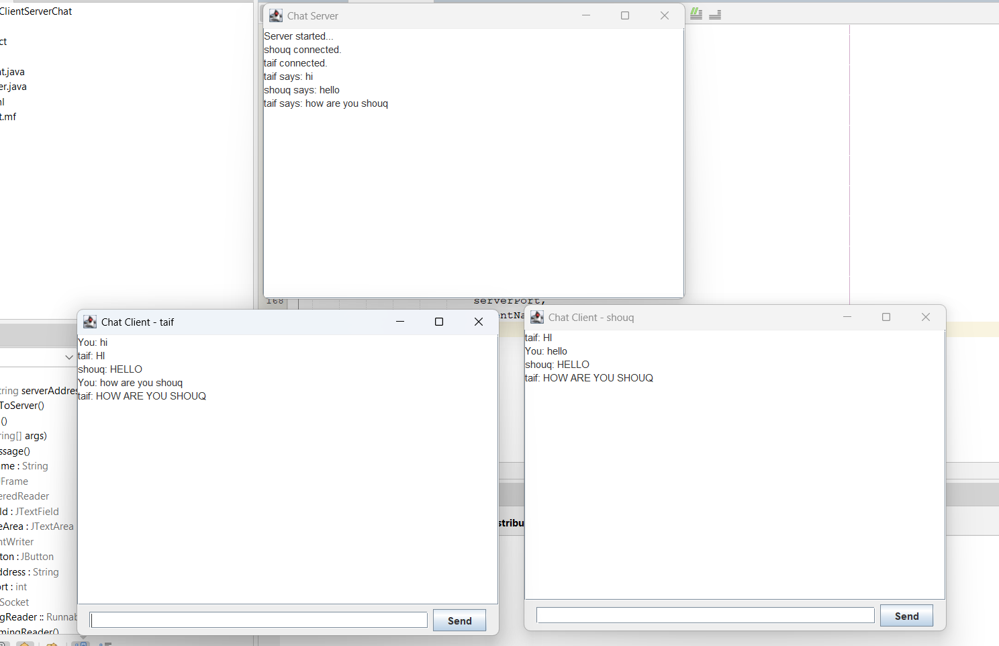

# Distributed Client-Server Chat System

A Java-based chat application that enables multiple clients to communicate in real time through a centralized server using socket programming and multithreading.

## Features

- Multi-client communication
- Real-time message broadcasting
- Multithreaded client handling
- Java Swing graphical interface
- TCP socket communication

## Technologies

`Java` `Socket Programming` `Multithreading` `Java Swing` `Client-Server`

## Project Structure

```text
src/
├── Client.java
└── Server.java
```

## Demo

Two clients connected simultaneously and exchanging messages through the server.



## How to Run

1. Run `Server.java`
2. Run `Client.java`
3. Start multiple clients with different usernames to test real-time communication.

## Author

**Shouq Majed Al-Subaie**
